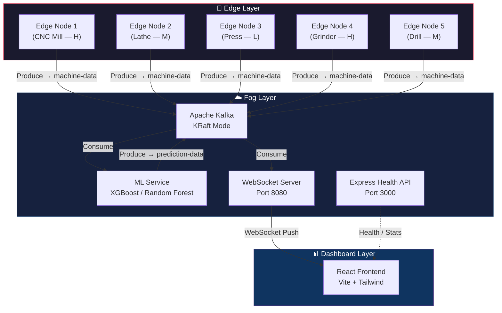
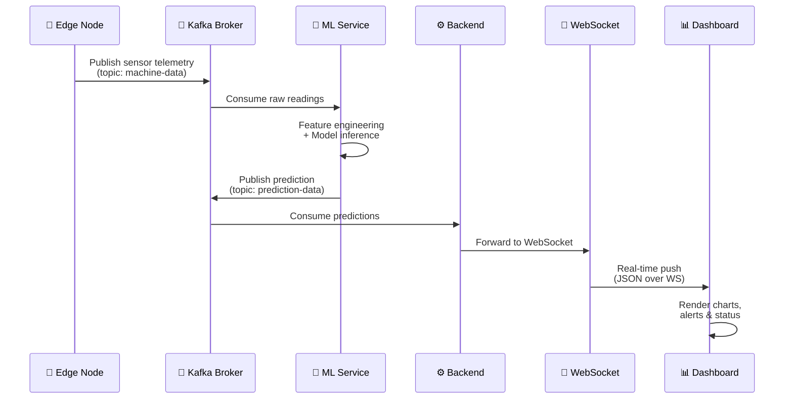
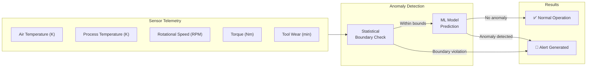
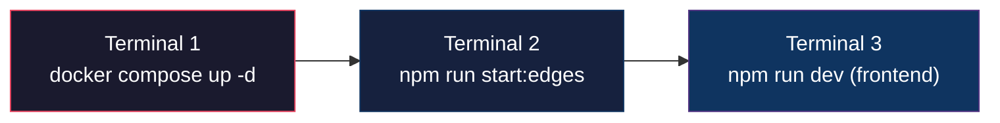
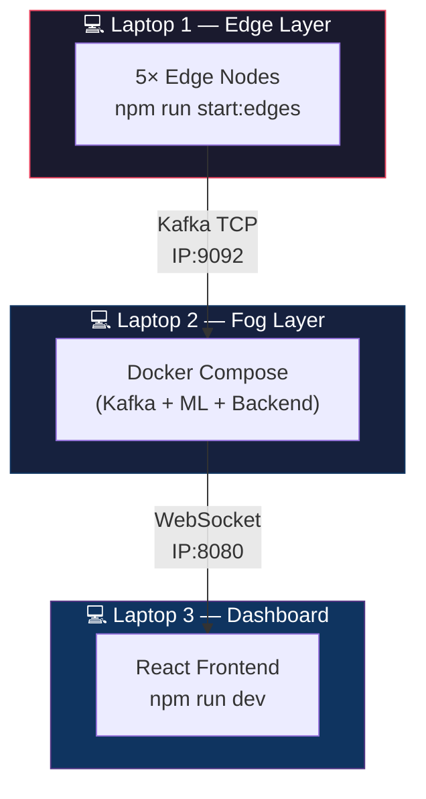
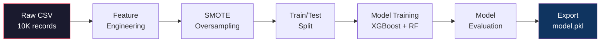
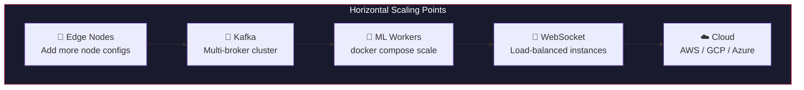

<](https://nodejs.org/)
[](https://typescriptlang.org/)
[](https://kafka.apache.org/)
[](https://python.org/)
[](https://react.dev/)
[](https://docker.com/)

</div>

---

## Table of Contents

- [Overview](#overview)
- [Architecture](#architecture)
  - [High-Level Diagram](#high-level-diagram)
  - [Data Flow Pipeline](#data-flow-pipeline)
  - [Component Interaction](#component-interaction)
- [Tech Stack](#tech-stack)
- [Project Structure](#project-structure)
- [Prerequisites](#prerequisites)
- [Getting Started](#getting-started)
  - [1. Clone the Repository](#1-clone-the-repository)
  - [2. Start the Fog Layer (Docker)](#2-start-the-fog-layer-docker)
  - [3. Start Edge Nodes](#3-start-edge-nodes)
  - [4. Start the Dashboard](#4-start-the-dashboard)
- [Running Modes](#running-modes)
  - [Single Machine (Development)](#single-machine-development)
  - [Multi-Laptop (Distributed Demo)](#multi-laptop-distributed-demo)
- [ML Model Details](#ml-model-details)
- [API Reference](#api-reference)
- [Kafka Topics](#kafka-topics)
- [Environment Variables](#environment-variables)
- [Scalability & Performance](#scalability--performance)
- [Future Roadmap](#future-roadmap)
- [Contributing](#contributing)
- [License](#license)

---

## Overview

**Alerion AI** simulates a full-scale industrial IoT monitoring pipeline. It generates machine sensor telemetry from edge nodes, streams it through Apache Kafka to a fog layer that performs both statistical boundary checks and ML-based anomaly detection, and pushes real-time predictions to a React dashboard via WebSockets.

> This project demonstrates scalable distributed systems architecture in a local multi-device environment.

**Key capabilities:**
- 🏭 **5 independent edge nodes** simulating CNC machines with realistic sensor drift & anomaly spikes
- ⚡ **Apache Kafka (KRaft mode)** for fault-tolerant, high-throughput event streaming
- 🤖 **Dual ML inference** — Flask standalone API + Dockerized FastAPI Kafka consumer
- 📊 **Real-time React dashboard** with live charts, alert feeds, and machine health views
- 🐳 **One-command Docker deployment** orchestrating Kafka, ML, and backend

---

## Architecture

### High-Level Diagram



### Data Flow Pipeline



### Component Interaction



---

## Tech Stack

| Layer | Technology | Purpose |
|:------|:-----------|:--------|
| **Edge** | Node.js 22, TypeScript, KafkaJS | Sensor data simulation & Kafka publishing |
| **Kafka** | Confluent Kafka 7.6.0 (KRaft) | Event streaming, topic partitioning, consumer groups |
| **ML (Dockerized)** | Python 3.11, FastAPI, Confluent Kafka | Real-time Kafka consumer → ML inference → Kafka producer |
| **ML (Standalone)** | Python, Flask, scikit-learn, XGBoost | REST API for batch & single predictions |
| **Backend** | Node.js, Express, WebSocket (ws) | Kafka → WebSocket bridge, health/stats endpoints |
| **Frontend** | React 19, Vite, Tailwind CSS, Recharts | Real-time dashboard, charts, alerts UI |
| **State** | Zustand | Frontend state management |
| **Animations** | Framer Motion | UI transitions & micro-animations |
| **Infra** | Docker, Docker Compose | One-command deployment of all services |

---

## Project Structure

```text
alerion-ai/
│
├── alerion-backend/              # ⚙️ Fog Layer (Node.js + Docker services)
│   ├── src/
│   │   ├── index.ts              #    Backend entrypoint (Express + WS + Consumers)
│   │   ├── config/
│   │   │   └── kafka.ts          #    Kafka client factory & topic management
│   │   ├── consumers/
│   │   │   ├── mlConsumer.ts     #    Kafka → ML inference → Kafka pipeline
│   │   │   └── predictionConsumer.ts  # Kafka → WebSocket bridge
│   │   ├── producers/
│   │   │   └── machineProducer.ts     # Edge → Kafka publisher
│   │   ├── edge/
│   │   │   ├── edgeSimulator.ts  #    Shared telemetry generator (Gaussian noise + drift)
│   │   │   ├── edgeNode1.ts      #    CNC Milling Machine (High capacity)
│   │   │   ├── edgeNode2.ts      #    Industrial Lathe (Medium)
│   │   │   ├── edgeNode3.ts      #    Hydraulic Press (Low)
│   │   │   ├── edgeNode4.ts      #    Surface Grinder (High)
│   │   │   └── edgeNode5.ts      #    Precision Drill (Medium)
│   │   ├── websocket/
│   │   │   └── wsServer.ts       #    WebSocket broadcast server
│   │   ├── types/
│   │   │   └── machine.types.ts  #    Shared TypeScript interfaces
│   │   ├── ml/                   #    Mock ML consumer (fallback)
│   │   └── test/
│   │       └── wsTestClient.ts   #    WebSocket test client
│   ├── ml-service/               # 🤖 Dockerized FastAPI ML microservice
│   │   ├── app/
│   │   │   ├── main.py           #    FastAPI app + Kafka consumer/producer
│   │   │   └── predictor.py      #    ML model loader + inference
│   │   ├── model/                #    Trained model artifacts (.pkl)
│   │   ├── Dockerfile
│   │   └── requirements.txt
│   ├── docker-compose.yml        # 🐳 Full stack orchestration
│   ├── Dockerfile                #    Backend container
│   ├── .env.example              #    Environment template
│   └── package.json
│
├── AlerionAI/                    # 📊 Dashboard (React + Vite)
│   ├── src/
│   │   ├── pages/
│   │   │   ├── Landing.tsx       #    Landing page
│   │   │   ├── Dashboard.tsx     #    Real-time monitoring dashboard
│   │   │   ├── Login.tsx         #    Authentication
│   │   │   ├── SignUp.tsx        #    Registration
│   │   │   ├── About.tsx         #    About page
│   │   │   └── Documentation.tsx #    Docs page
│   │   ├── components/           #    25 reusable UI components
│   │   ├── services/
│   │   │   └── telemetryService.ts  # WebSocket client
│   │   ├── store/                #    Zustand state stores
│   │   ├── hooks/                #    Custom React hooks
│   │   ├── types/                #    TypeScript types
│   │   └── styles/               #    Global styles
│   ├── index.html
│   ├── vite.config.ts
│   └── package.json
│
├── ml/                           # 🧪 Standalone ML Training & API
│   ├── app.py                    #    Flask REST API (/predict, /predict/batch)
│   ├── training_notebook.ipynb   #    Jupyter notebook — model training pipeline
│   ├── predictive_maintenance.csv#    Training dataset (10,000 records)
│   ├── model_artifacts/          #    Saved models, scaler, label encoder
│   │   ├── model.pkl
│   │   ├── scaler.pkl
│   │   ├── label_encoder.pkl
│   │   └── metadata.json
│   ├── requirements.txt
│   └── *.png                     #    Visualizations (confusion matrices, distributions)
│
├── infrastructure/               # 🏗️ Infrastructure configs
│   └── kafka/                    #    Kafka configuration files
│
├── .gitignore
└── README.md                     #    ← You are here
```

---

## Prerequisites

| Tool | Version | Install |
|:-----|:--------|:--------|
| **Node.js** | ≥ 22.x | [nodejs.org](https://nodejs.org/) |
| **npm** | ≥ 10.x | Included with Node.js |
| **Docker** | ≥ 24.x | [docker.com](https://docker.com/) |
| **Docker Compose** | ≥ 2.20 | Included with Docker Desktop |
| **Python** | ≥ 3.10 | [python.org](https://python.org/) *(only for standalone ML)* |

---

## Getting Started

### 1. Clone the Repository

```bash
git clone https://github.com/DevanshBehl/Alerion-AI.git
cd Alerion-AI
```

### 2. Start the Fog Layer (Docker)

This single command boots **Kafka**, the **Python ML service**, and the **Node.js backend**:

```bash
cd alerion-backend

# Copy the environment template
cp .env.example .env

# Start all services (Kafka + ML + Backend)
docker compose up -d
```

**Verify services are running:**

```bash
# Check container status
docker compose ps

# Expected output:
# alerion-kafka        Running   0.0.0.0:9092->9092/tcp
# alerion-ml-service   Running   0.0.0.0:8000->8000/tcp
# alerion-backend      Running   0.0.0.0:3000->3000/tcp, 0.0.0.0:8080->8080/tcp

# Check backend health
curl http://localhost:3000/health

# Check ML service health
curl http://localhost:8000/health
```

<details>
<summary>📋 <strong>Individual service commands</strong></summary>

```bash
# Start only Kafka
docker compose up kafka -d

# Start all services and follow logs
docker compose up -d && docker compose logs -f

# View ML service logs
docker compose logs -f ml-service

# Scale ML service to 3 replicas
docker compose up --scale ml-service=3 -d

# Stop all services
docker compose down

# Stop and remove volumes (clean reset)
docker compose down -v
```

</details>

### 3. Start Edge Nodes

Open a **new terminal** (keep Docker running):

```bash
cd alerion-backend

# Install dependencies (first time only)
npm install

# Option A: Start all 5 edge nodes simultaneously
npm run start:edges

# Option B: Start individual edge nodes
npm run start:edge1   # CNC Milling Machine (High capacity)
npm run start:edge2   # Industrial Lathe (Medium capacity)
npm run start:edge3   # Hydraulic Press (Low capacity)
npm run start:edge4   # Surface Grinder (High capacity)
npm run start:edge5   # Precision Drill (Medium capacity)
```

You should see telemetry being sent:

```text
╔════════════════════════════════════════════╗
║  ALERION AI — Edge Node Simulator          ║
║  Machine: MACHINE-001                      ║
║  Type:    H                                ║
║  Interval: 500ms                           ║
╚════════════════════════════════════════════╝

[MACHINE-001] → Sent: temp=305.2K, rpm=1847, torque=42.3Nm
[MACHINE-001] → Sent: temp=306.1K, rpm=1832, torque=43.1Nm
```

### 4. Start the Dashboard

Open **another terminal**:

```bash
cd AlerionAI

# Install dependencies (first time only)
npm install

# Start the development server
npm run dev
```

The dashboard will open at **http://localhost:5173** (Vite default).

> **⚡ All three layers are now running!** Edge nodes → Kafka → ML → WebSocket → Dashboard

---

## Running Modes

### Single Machine (Development)

Everything runs on one machine. This is the default setup.



**Step-by-step:**

| Step | Terminal | Command | Purpose |
|:----:|:---------|:--------|:--------|
| 1 | Terminal 1 | `cd alerion-backend && docker compose up -d` | Start Kafka + ML + Backend |
| 2 | Terminal 2 | `cd alerion-backend && npm install && npm run start:edges` | Start edge nodes |
| 3 | Terminal 3 | `cd AlerionAI && npm install && npm run dev` | Start dashboard |
| 4 | Browser | Open `http://localhost:5173` | View real-time dashboard |

### Multi-Laptop (Distributed Demo)

For the full distributed experience across **3 physical machines** on the same network.



**Step-by-step:**

#### Step 1 — Find the Fog Laptop IP

On **Laptop 2** (Fog), run:

```bash
# macOS
ipconfig getifaddr en0

# Linux
hostname -I | awk '{print $1}'

# Windows
ipconfig | findstr "IPv4"
```

> Example output: `192.168.1.45`

#### Step 2 — Start Fog Layer (Laptop 2)

```bash
cd alerion-backend

# Update Kafka advertised listeners for external access
# Edit docker-compose.yml → KAFKA_ADVERTISED_LISTENERS:
#   EXTERNAL://192.168.1.45:9092  (replace localhost)

docker compose up -d
```

#### Step 3 — Start Edge Nodes (Laptop 1)

```bash
cd alerion-backend

# Update .env to point to Fog laptop
echo "KAFKA_BROKERS=192.168.1.45:9092" > .env

npm install
npm run start:edges
```

#### Step 4 — Start Dashboard (Laptop 3)

```bash
cd AlerionAI

# Update WebSocket URL in the telemetry service to:
# ws://192.168.1.45:8080

npm install
npm run dev
```

---

## ML Model Details

### Training Pipeline

The model is trained on the [Predictive Maintenance Dataset](https://archive.ics.uci.edu/ml/datasets/AI4I+2020+Predictive+Maintenance+Dataset) (10,000 records) with the following pipeline:



### Features Used

| Feature | Description | Range |
|:--------|:------------|:------|
| `Air temperature [K]` | Ambient air temperature | 290–320 K |
| `Process temperature [K]` | Process operating temperature | 300–340 K |
| `Rotational speed [rpm]` | Spindle RPM | 1,000–3,000 |
| `Torque [Nm]` | Torque applied | 10–80 Nm |
| `Tool wear [min]` | Cumulative tool usage | 0–250 min |
| `type_encoded` | Machine type (L=0, M=1, H=2) | 0–2 |
| `temp_diff` | Process − Air temperature | Derived |
| `power_W` | Torque × angular velocity | Derived |
| `torque_x_wear` | Torque × tool wear | Derived |
| `rpm_per_torque` | RPM / Torque ratio | Derived |

### Failure Classes

| Class | Severity | Description |
|:------|:---------|:------------|
| No Failure | — | Normal operation |
| Heat Dissipation Failure | 🔴 High | Overheating condition |
| Power Failure | 🔴 High | Electrical/power anomaly |
| Overstrain Failure | 🔴 High | Mechanical overstress |
| Tool Wear Failure | 🟡 Medium | Gradual tool degradation |
| Random Failures | 🟡 Medium | Unpredictable failure events |

### Running the Standalone ML API

```bash
cd ml

# Create virtual environment
python -m venv .venv
source .venv/bin/activate    # macOS/Linux
# .venv\Scripts\activate     # Windows

# Install dependencies
pip install -r requirements.txt

# Start the Flask API
python app.py
# → API running at http://localhost:5000
```

**Test a prediction:**

```bash
curl -X POST http://localhost:5000/predict \
  -H "Content-Type: application/json" \
  -d '{
    "air_temperature": 298.1,
    "process_temperature": 308.6,
    "rotational_speed": 1551,
    "torque": 42.8,
    "tool_wear": 0,
    "machine_type": "M"
  }'
```

---

## API Reference

### Backend (Express — Port 3000)

| Method | Endpoint | Description |
|:-------|:---------|:------------|
| `GET` | `/health` | Service health check (uptime, status) |
| `GET` | `/stats` | WebSocket stats (connected clients, messages) |
| `GET` | `/ready` | Readiness probe for orchestrators |

### ML Service — Flask (Port 5000)

| Method | Endpoint | Description |
|:-------|:---------|:------------|
| `GET` | `/health` | Model info & service status |
| `GET` | `/classes` | List all failure classes |
| `GET` | `/metadata` | Full model metadata (features, metrics) |
| `POST` | `/predict` | Single reading prediction |
| `POST` | `/predict/batch` | Batch predictions (max 100 readings) |

### ML Service — FastAPI / Docker (Port 8000)

The Dockerized ML service consumes directly from Kafka (`machine-data` topic), runs inference, and publishes results to the `prediction-data` topic. It also exposes a health endpoint.

### WebSocket (Port 8080)

Clients connect to `ws://localhost:8080` and receive JSON messages:

```json
{
  "type": "prediction",
  "payload": {
    "machine_id": "MACHINE-001",
    "machine_type": "H",
    "air_temperature": 305.2,
    "process_temperature": 312.4,
    "rotational_speed": 1847,
    "torque": 42.3,
    "tool_wear": 128,
    "prediction": 0,
    "confidence": 0.94,
    "anomalyScore": 0.12,
    "failure_type": "No Failure",
    "processed_at": "2026-02-19T01:10:00.000Z"
  },
  "timestamp": "2026-02-19T01:10:00.000Z"
}
```

Message types: `prediction` | `alert` | `heartbeat` | `system`

---

## Kafka Topics

| Topic | Partitions | Producer | Consumer | Description |
|:------|:-----------|:---------|:---------|:------------|
| `machine-data` | 5 | Edge Nodes | ML Service | Raw sensor telemetry |
| `prediction-data` | 5 | ML Service | Backend | ML prediction results |

Topics are auto-created by Kafka (configured via `KAFKA_AUTO_CREATE_TOPICS_ENABLE=true`), or you can create them manually:

```bash
# Create topics manually
docker exec -it alerion-kafka kafka-topics \
  --create --topic machine-data \
  --bootstrap-server localhost:9092 \
  --partitions 5 --replication-factor 1

docker exec -it alerion-kafka kafka-topics \
  --create --topic prediction-data \
  --bootstrap-server localhost:9092 \
  --partitions 5 --replication-factor 1

# List all topics
docker exec -it alerion-kafka kafka-topics \
  --list --bootstrap-server localhost:9092

# Consume messages from a topic (debug)
docker exec -it alerion-kafka kafka-console-consumer \
  --topic machine-data \
  --bootstrap-server localhost:9092 \
  --from-beginning
```

---

## Environment Variables

### Backend (`alerion-backend/.env`)

| Variable | Default | Description |
|:---------|:--------|:------------|
| `KAFKA_BROKERS` | `localhost:9092` | Kafka bootstrap servers |
| `KAFKA_CLIENT_ID` | `alerion-backend` | Kafka client identifier |
| `WS_PORT` | `8080` | WebSocket server port |
| `HTTP_PORT` | `3000` | Express health server port |
| `ML_SERVICE_URL` | `http://localhost:8000` | Python ML service URL |
| `USE_MOCK_ML` | `true` | Use TypeScript mock ML (set `false` for Python service) |
| `MACHINE_DATA_TOPIC` | `machine-data` | Topic for raw telemetry |
| `PREDICTION_DATA_TOPIC` | `prediction-data` | Topic for ML predictions |

---

## Scalability & Performance

### Current Capabilities

| Metric | Value |
|:-------|:------|
| Edge nodes (demo) | 5 concurrent simulators |
| Message rate (demo) | ~10 msg/sec (2/sec per node) |
| Max throughput | 10,000+ msg/sec (hardware dependent) |
| Kafka partitions | 5 per topic |
| WebSocket clients | Unlimited (broadcast) |
| ML replicas | Scalable via `docker compose --scale` |

### Scalability Architecture



---

## Future Roadmap

- [ ] Kubernetes deployment manifests (Helm charts)
- [ ] Multi-broker Kafka cluster for fault tolerance
- [ ] Redis caching for prediction results
- [ ] Alert escalation via email / SMS / Slack
- [ ] Edge AI preprocessing (TensorFlow Lite)
- [ ] Time-series database integration (InfluxDB / TimescaleDB)
- [ ] Grafana monitoring dashboards
- [ ] OAuth2 / SSO authentication
- [ ] CI/CD pipeline (GitHub Actions)

---

## Contributing

1. **Fork** the repository
2. Create a feature branch: `git checkout -b feature/my-feature`
3. Commit changes: `git commit -m "feat: add my feature"`
4. Push to the branch: `git push origin feature/my-feature`
5. Open a **Pull Request**

---

## License

This project is developed by the **Alerion AI Team** for distributed systems & AI engineering research.

---

<div align="center">

**Built with ❤️ by [Devansh Behl](https://github.com/DevanshBehl)**

*Distributed Systems & AI Engineering*

</div>
]]>